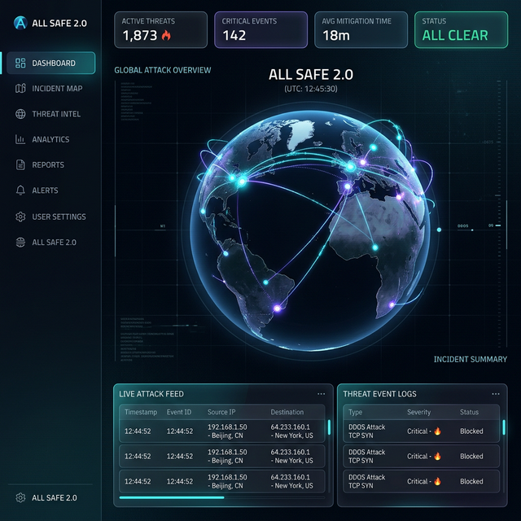
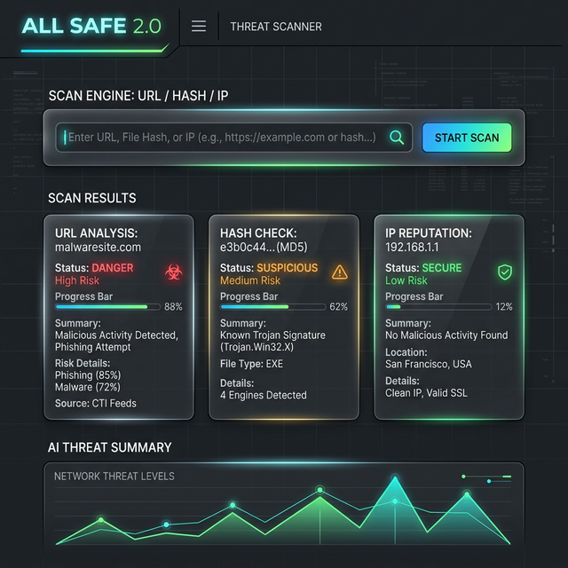
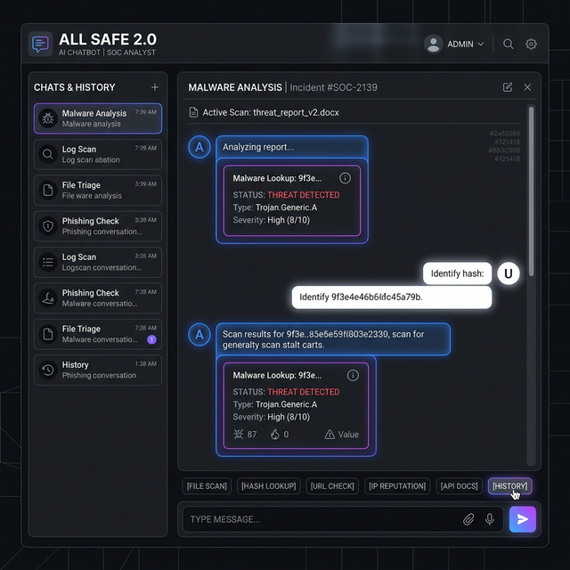

# 🖼️ ALL SAFE 2.0 — UI Wireframes

> Visual concepts and interface blueprints showcasing the layout and high-tech Glassmorphism aesthetic of the platform.

---

## 1. Global SOC Dashboard & Live Threat Map

**Key Elements:**
*   **Central Focus:** 3D Earth globe (`react-globe.gl`) visualizing real-time attack arcs.
*   **Top Bar:** Key statistics, active users, and global threat score.
*   **Left Navigation:** Icon-based vertical sidebar for module switching.
*   **Bottom/Side Panels:** Real-time scrolling feed of incoming cyber attacks via WebSockets.

---

## 2. Threat Intelligence Scanner

**Key Elements:**
*   **Input Center:** Large, unified input field supporting URLs, Hashes, IPs, Domains, and Emails.
*   **Action Row:** Specific scan-type toggle buttons for quick selection.
*   **Analysis Dashboard:** Glassmorphism UI cards that populate upon scan completion.
*   **Risk Evaluation:** A clear indicator showing Risk Level (CLEAN/LOW/MEDIUM/HIGH) alongside AI-generated summaries.

---

## 3. ALL SAFE AI Chatbot

**Key Elements:**
*   **Conversational Canvas:** Interactive scrollable view showing user and AI conversation bubbles.
*   **Inline Intelligence Cards:** The AI automatically embeds graphical Threat Result Cards directly into the flow of conversation.
*   **Quick Actions:** Sticky suggestion chips above the input box for fast, 1-click commands (e.g., *Scan URL*, *Malware Lookup*).
*   **Command Bar:** Input text area with a prominent, glowing "Send" button.

---
