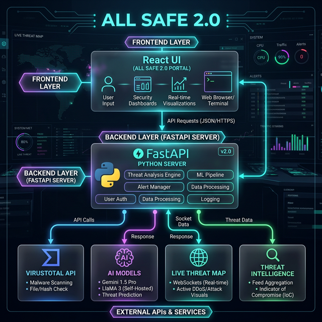
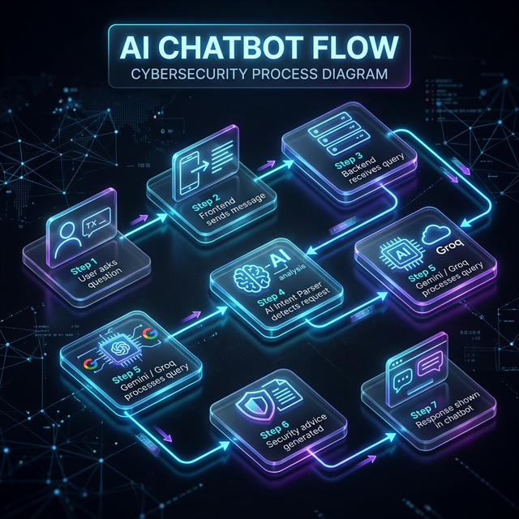
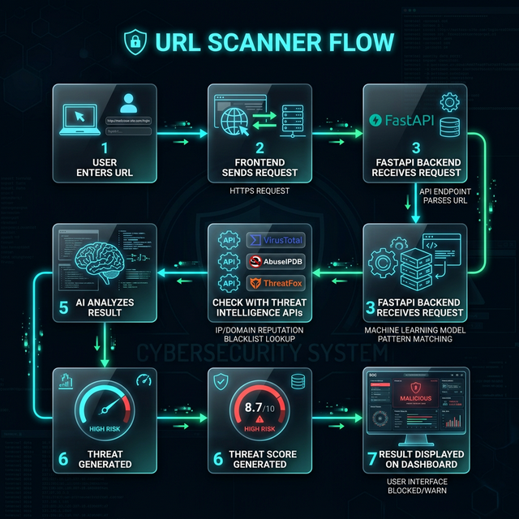
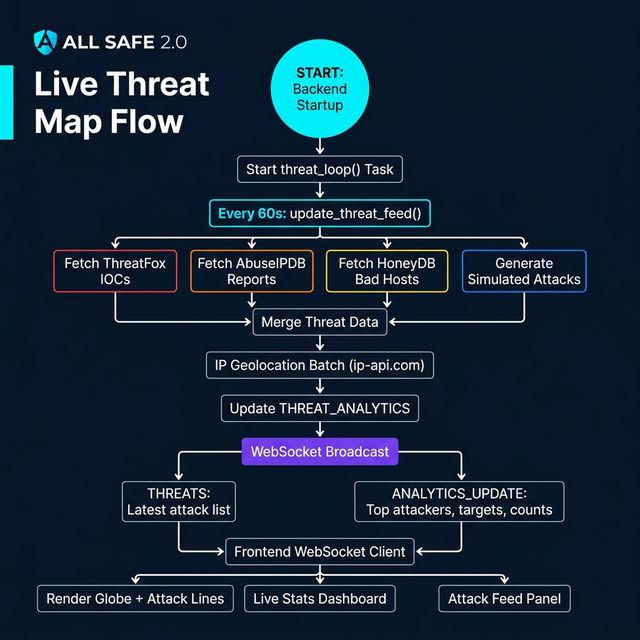
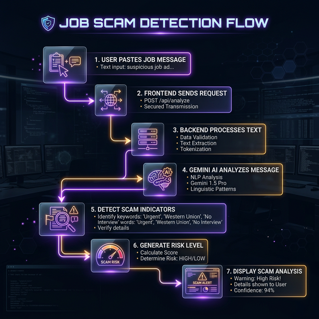
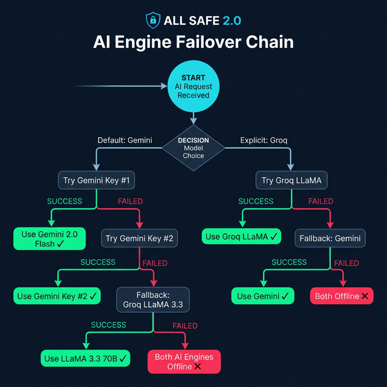
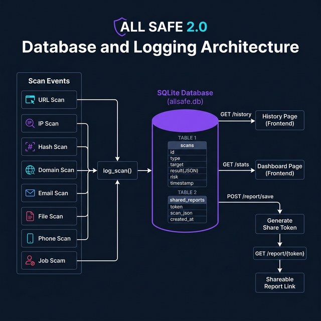
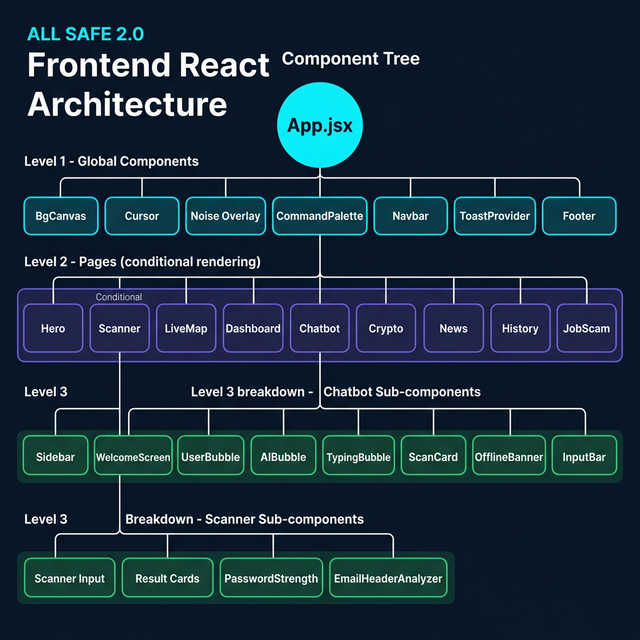
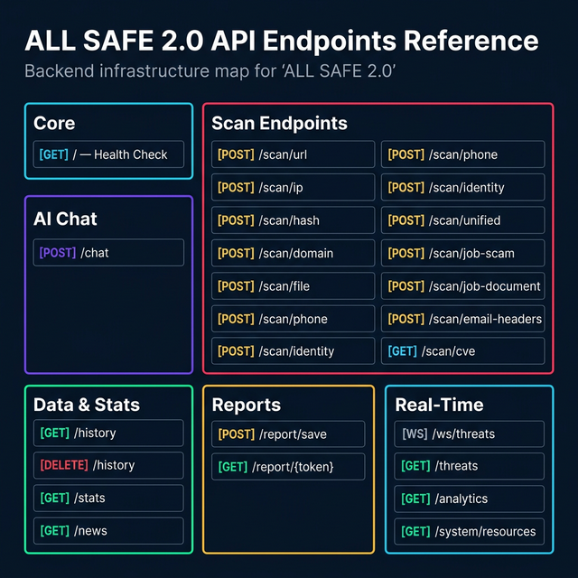

# 🛡️ ALL SAFE 2.0 — Flow Diagrams

> Complete system architecture and data flow documentation for the ALL SAFE Cybersecurity Platform.

---

## 1. System Architecture Overview

> **Frontend** (React + Vite) communicates with the **Backend** (FastAPI + Python) via REST and WebSocket. The Backend queries **External APIs** like VirusTotal, AbuseIPDB, HoneyDB, Google Gemini AI, and Groq LLaMA.

---

## 2. AI Chatbot Flow

> The chatbot uses an **Intent Router** (AI-powered) to parse user messages and automatically trigger scans (URL, IP, Hash, Domain, Email, Job Scam). Results are fed as context to the AI for a comprehensive reply. **Gemini is primary, Groq LLaMA is the fallback.**

**Detailed Internal Flow:**
1. User asks question
2. Frontend sends message
3. Backend receives query
4. AI Intent Parser detects request
5. Gemini / Groq processes query
6. Security advice generated
7. Response shown in chatbot

---

## 3. Threat Scanner Pipeline

> The scanner **auto-detects** input type (URL, IP, Hash, Domain, Email, Phone, File) and routes to the appropriate API. Risk is calculated from detection counts: 🟢 CLEAN → 🟡 LOW → 🟠 MEDIUM → 🔴 HIGH.

**Detailed Internal URL Scanner Flow:**
1. User enters URL
2. Frontend sends request
3. FastAPI Backend receives request
4. Check with Threat Intelligence APIs (VirusTotal / AbuseIPDB / ThreatFox)
5. AI analyzes result
6. Threat score generated
7. Result displayed on dashboard

---

## 4. Live Threat Map Flow

> Every 60 seconds, the backend fetches threats from **ThreatFox, AbuseIPDB, and HoneyDB**, geolocates IPs, and broadcasts updates via **WebSocket** to the Live Map globe visualization.

---

## 5. Job Scam Detection Flow

> Combines **8 rule-based pattern checks** (upfront fees, unrealistic salary, urgency tactics, etc.) with **Gemini AI deep analysis** for accurate scam classification.

**Detailed Internal Flow:**
1. User pastes job message
2. Frontend sends request
3. Backend processes text
4. Gemini AI analyzes message
5. Detect scam indicators
6. Generate risk level
7. Display scam analysis

---

## 6. AI Engine Failover Chain

> Two Gemini API keys provide redundancy. If both fail, the system falls back to **Groq LLaMA 3.3 70B**. The reverse applies when Groq is explicitly selected.

---

## 7. Database & Logging Architecture

> All scans are logged to **SQLite** with type, target, JSON result, risk level, and timestamp. Reports can be shared via unique tokens.

---

## 8. Frontend Component Tree

> **17 React components** organized in a clean hierarchy. `App.jsx` manages routing between 9 pages with animated transitions.

---

## 9. API Endpoints Map

> **25+ API endpoints** covering scanning (12 endpoints), AI chat, statistics, history, news, report sharing, and real-time WebSocket feeds.

---

## Quick Reference Table

| # | Diagram | Key Insight |
|---|---------|-------------|
| 1 | **System Architecture** | 3-tier: React → FastAPI → 8 External APIs |
| 2 | **AI Chatbot** | Intent parsing → Auto-scan → AI reply with Gemini/Groq fallback |
| 3 | **Threat Scanner** | 7 input types auto-detected, 4 risk levels |
| 4 | **Live Map** | ThreatFox + AbuseIPDB + HoneyDB → WebSocket → Globe |
| 5 | **Job Scam** | 8 pattern rules + Gemini AI = 3-tier risk classification |
| 6 | **AI Failover** | Dual Gemini keys + Groq LLaMA = near-100% uptime |
| 7 | **Database** | SQLite with 2 tables: scans + shared_reports |
| 8 | **Components** | 17 React components in 3-level hierarchy |
| 9 | **API Map** | 25+ endpoints across 6 categories |
